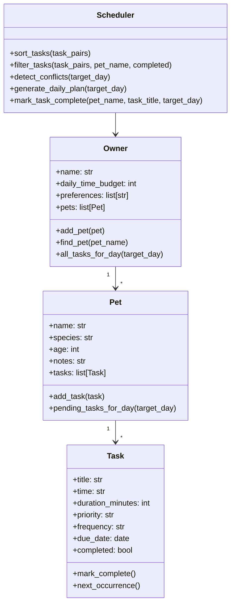

# PawPal+ (Module 2 Project)

PawPal+ is a Streamlit pet care planner that helps an owner manage tasks across pets, sort them into a daily plan, and explain why those tasks were chosen. This build uses a light Alaska brown bear / modern Goldilocks theme for the sample data while still following the project requirements.

## Features

- Add pets and care tasks from the Streamlit app
- Store owner, pet, and task data in backend Python classes
- Generate a daily plan based on time budget, task time, and priority
- Sort tasks chronologically and filter out completed work
- Detect same-time conflicts and show warnings in the UI
- Create the next occurrence automatically for daily and weekly recurring tasks
- Run a CLI demo through `main.py` to verify the logic outside Streamlit

## System Design

The project uses four core classes:

- `Owner`: stores the owner's name, available time budget, preferences, and pets
- `Pet`: stores pet details and the list of tasks assigned to that pet
- `Task`: stores title, time, duration, priority, frequency, date, and completion state
- `Scheduler`: sorts tasks, builds a plan, flags conflicts, and handles recurring tasks



## Smarter Scheduling

The scheduler applies a few simple algorithms:

- Sort tasks by date, time, and priority
- Skip tasks that do not fit within the owner's daily time budget
- Warn when multiple tasks share the same start time
- Create the next daily or weekly task when a recurring task is marked complete

## Getting Started

```bash
python -m venv .venv
source .venv/bin/activate
pip install -r requirements.txt
streamlit run app.py
```

To preview the backend in the terminal:

```bash
python main.py
```

## Testing PawPal+

Run the automated tests with:

```bash
python -m pytest
```

The current test suite covers task completion, task addition, chronological sorting, recurring task creation, and exact-time conflict detection.

Confidence Level: `★★★★☆`

## Demo

Add pets, create tasks, and click `Generate schedule` to see the sorted daily plan and any conflict warnings. The seeded demo data includes brown bears named Kodiak and Maple to keep the assignment a little more memorable without changing the required architecture.


