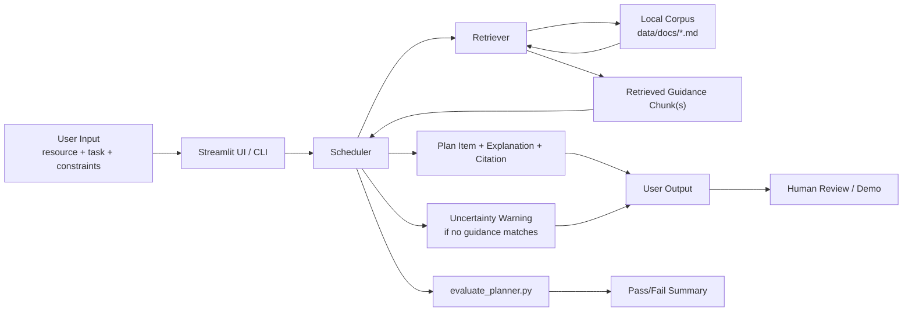

# LunaHabitat Planner

LunaHabitat Planner is a retrieval-augmented lunar habitat operations planner. It retrieves local mission guidance documents before generating schedule explanations for maintenance, expansion, monitoring, and communications tasks, and it warns when no supporting guidance is found.

This project extends **Module 2: PawPal+**. The original project was a pet-care scheduling system that organized tasks by time, priority, and owner constraints, while also detecting conflicts and explaining why tasks were scheduled. This final project keeps that scheduling backbone and adapts it into a lunar habitat planning system with integrated retrieval and guardrails.

## Why This Project Matters

Lunar habitat operations involve limited crew time, overlapping priorities, and safety-sensitive decisions. A planner that can retrieve relevant operational guidance before explaining a schedule is more transparent than a plain rule-based scheduler and easier to evaluate than a free-form chatbot.

## Current AI Feature

The current AI feature is a lightweight local **RAG pipeline**:

1. a task and resource are provided to the planner
2. the retriever searches the local corpus in `data/docs/`
3. the scheduler uses the retrieved guidance to produce a grounded explanation
4. the system shows a citation or an uncertainty warning

This is a non-LLM RAG design. The retrieval is keyword-based and the response text is template-driven, but the retrieved guidance still changes how the application behaves.

## Architecture Overview

The system has five main parts:

- `Streamlit UI / CLI`: collects user input and shows schedules
- `Scheduler`: sorts and selects tasks under time and priority constraints
- `Retriever`: searches local guidance documents for relevant chunks
- `Corpus`: curated lunar habitat guidance documents under `data/docs/`
- `Evaluator`: scenario-based checks for citation behavior and uncertainty guardrails



The Mermaid source for the architecture diagram is also provided in [assets/architecture-diagram.mmd](assets/architecture-diagram.mmd).

## Features

- Add habitat resources and operations tasks from the Streamlit app
- Generate a daily mission schedule based on time budget, task time, and priority
- Retrieve matching local guidance before writing a schedule explanation
- Show a citation for matched guidance
- Show an uncertainty warning when no guidance matches
- Detect same-time conflicts
- Run a CLI demo through `main.py`
- Run a scenario-based evaluator through `evaluate_planner.py`

## Project Structure

```text
assets/
data/
  corpus-manifest.md
  docs/
evaluate_planner.py
app.py
main.py
model_card.md
pawpal_system.py
retriever.py
tests/
```

## Setup Instructions

```bash
python3 -m venv .venv
source .venv/bin/activate
pip install -r requirements.txt
```

Run the app:

```bash
streamlit run app.py
```

Run the CLI demo:

```bash
python3 main.py
```

Run tests:

```bash
python3 -m pytest
```

Run the retrieval evaluation:

```bash
python3 evaluate_planner.py
```

## Sample Interactions

### Example 1: Life-support task

Input:

- resource: `Oxygen Recycler`
- task: `Oxygen recycler diagnostics`

Output behavior:

- citation: `Oxygen Recycler Checks`
- explanation says the task is supported by retrieved guidance
- no uncertainty warning is shown

### Example 2: Construction task

Input:

- resource: `Habitat Shell`
- task: `Expansion scaffold inspection`

Output behavior:

- citation: `Construction Zone Safety`
- explanation is grounded in construction guidance
- no uncertainty warning is shown

### Example 3: Unknown task

Input:

- resource: `Art Bay`
- task: `Art mural touch-up`

Output behavior:

- citation: `No matching guidance`
- explanation says no matching guidance was retrieved
- uncertainty warning is shown for manual review

## Design Decisions

- I used a **small curated local corpus** so the retrieval behavior is easy to inspect and explain.
- I kept the inherited scheduler backbone from Module 2 to preserve the connection to the base project.
- I used **keyword retrieval** instead of embeddings or an external API to keep the system reproducible and lightweight.
- I used **template-based explanations** so the role of retrieval is visible and predictable.

## Testing Summary

The project currently includes:

- inherited scheduler unit tests in `tests/test_pawpal.py`
- retrieval-focused tests for matched and unmatched guidance behavior
- a small scenario runner in `evaluate_planner.py`

Current evaluation result:

- `4/4` evaluation scenarios passed

The current guardrail focus is:

- matched tasks should show the expected citation
- unmatched tasks should trigger uncertainty warnings

## Reliability And Guardrails

The system currently improves reliability by:

- restricting grounding to the local corpus
- exposing citations for retrieved guidance
- warning when no guidance matches

More detail is documented in [guardrails-summary.md](guardrails-summary.md).

## Limitations

- Retrieval is keyword-based rather than semantic.
- Explanations are template-driven rather than LLM-generated.
- The current domain model still uses inherited class names like `Pet`.
- The corpus is small and curated, so it cannot represent real lunar operations comprehensively.

## Reflection

This project showed that even a lightweight retrieval pipeline can make a planner more transparent and testable. It also highlighted an important tradeoff: simple retrieval is easier to evaluate, but it can miss meaning that a stronger semantic or model-based system might capture.

## Assets And Demo

Place your rendered architecture image and any screenshots in `assets/`.

### Video Walkthrough

Primary Loom walkthrough:

- [LunaHabitat Planner Walkthrough 1](https://www.loom.com/share/e27816fdca854d9b88aaabb5919aeb5f)

Alternate Loom walkthrough:

- [LunaHabitat Planner Walkthrough 2](https://www.loom.com/share/eac4ab325b474cb3aa946e59da0a4990)

### Screenshot Placeholders

Replace the placeholder URLs below with your uploaded GitHub image links or screenshot asset paths.

**1. Scenario A: Oxygen guidance match**

Caption: The planner retrieves `Oxygen Recycler Checks` for a life-support task and produces a citation-backed explanation without an uncertainty warning.

| Scenario A Demo Panel |
| --- |
| <br><br> |


**2. Scenario B: Construction guidance match**

Caption: The planner retrieves `Construction Zone Safety` for a construction-related task, showing that different task types pull different supporting documents.

| Scenario B Demo Panel |
| --- |
| <br><br> |


**3. Scenario C: Uncertainty guardrail**

Caption: When a task does not match the local corpus, the planner returns `No matching guidance` and shows an uncertainty warning for manual review.

| Scenario C Demo Panel |
| --- |
| <br><br><br><br><br><br> |


**4. Evaluation script result**

Caption: The scenario-based evaluator reports `4/4` cases passed, covering guidance matches and the missing-guidance guardrail.

| Evaluation Demo Panel |
| --- |
|  |
